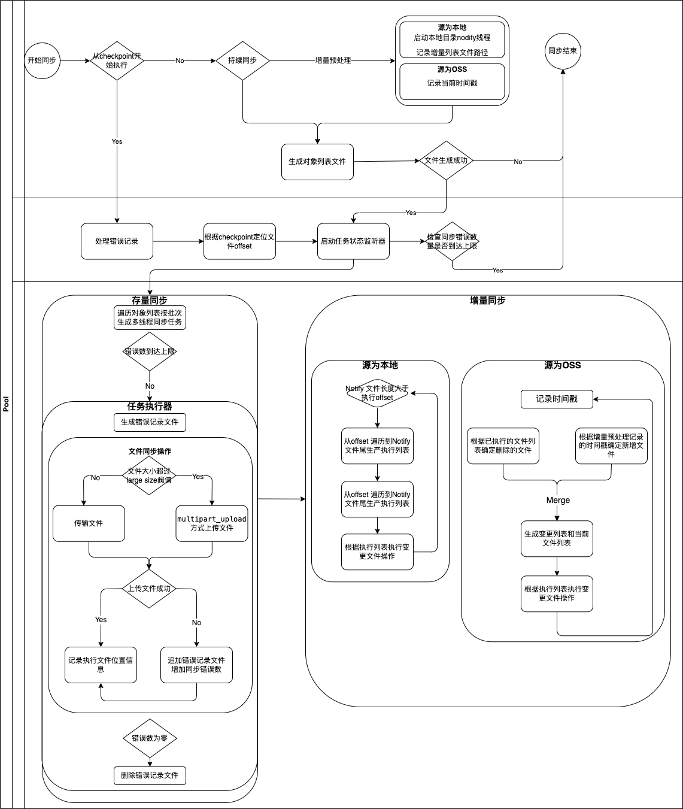

# OSS PIPE 

## 主要功能

### transfer 
文件迁移，包括oss 间文件迁移和本地到oss的文件迁移

* 主要功能
  * 全量迁移
  * 存量迁移
  * 增量迁移
  * 断点续传
  * 大文件拆分上传
  * 正则表达式过滤
  * 线程数与上传快大小组合控制带宽

* 存储适配及支持列表
  * 京东云对象存储
  * 阿里云对象存储
  * 腾讯云对象存储
  * 华为云对象存储
  * AWS对象存储
  * Minio
  * 本地

### compare 
文件校验，检查源文件与迁移完成后目标文件的差异

* 主要功能
  * 存在性校验
  * 文件长度校验
  * meta数据校验
  * 过期时间校验
  * 全字节流校验

## Getting Stated


### 基本使用

oss_pipe 支持命令执行模式和交互式执行模式。
您可以通过 oss_pipe [subcommand] 执行执行任务，比如

```shell
oss_pipe parameters provider
```

也可以通过 oss_pipe -i 命里进入交互模式。交互模式支持按 'tab' 键进行子命令提示。

### 定义任务

通过 oss_pipe template 命令生成模板

```shell
oss_pipe template transfer oss2oss /tmp/transfer.yml
```

transfer.yml 文件内容

```yml
task_id: '7143131817338605569'
name: transfer oss to oss
task_desc:
  type: transfer
  source:
    provider: ALI
    access_key_id: access_key_id
    secret_access_key: secret_access_key
    endpoint: http://oss-cn-beijing.aliyuncs.com
    region: cn-north-1
    bucket: bucket_name
    prefix: test/samples/
  target:
    provider: JD
    access_key_id: access_key_id
    secret_access_key: secret_access_key
    endpoint: http://s3.cn-north-1.jdcloud-oss.com
    region: cn-north-1
    bucket: bucket_name
    prefix: test/samples/
  attributes:
    bach_size: 100
    task_parallelism: 12
    max_errors: 1
    meta_dir: /tmp/meta_dir
    target_exists_skip: false
    start_from_checkpoint: false
    large_file_size: 50m
    multi_part_chunk: 10m
    exclude:
    - test/t3/*
    - test/t4/*
    include:
    - test/t1/*
    - test/t2/*
    continuous: false
    transfer_type: Stock
    last_modify_filter:
      filter_type: Greater
      timestamp: 1703055338
```

修改 access_key_id secret_access_key 等参数，适配自己的任务。template 命令按照任务类型创建模版,模板描述请参考[参考手册](reference_cn.md)。parameters 支持参数查询，包括支持的provider 以及 任务类型

#### 执行任务

osstask 子命令用于执行任务

```shell
oss_pipe task exec filepath/task.yml
```

## 参考手册

### 命令详解

oss_pipe 同时支持命令行模式和交互模式 oss_pipe -i 进入交互模式。交互模式使用'tab'键进行子命令提示。

* osstask  
  通过yaml描述文件执行相关任务
  * 命令格式
  
    ```shell
    task exec <filepath>
    ```

  * 命令行模式示例

    ```shell
    oss_pipe task exec yourpath/exec.yml
    ```

  * 交互模式示例

    ```shell
    oss_pipe> task exec yourpath/exec.yml
    ```

* template  
  生成任务模板,通过子命令指定任务类型
  * 命令格式
  
    ```shell
    template [subcommand] [file]
    ```

  * 命令行模式示例

    ```shell
    oss_pipe template transfer oss2oss /tmp/transfer_oss2oss.yml
    ```

  * 交互模式示例

    ```shell
    oss_pipe> template transfer oss2oss /tmp/transfer_oss2oss.yml
    ```

* parameters  
  参数查询，输出所支持的 oss 供应商，以及任务类型。
  * 命令格式
  
    ```shell
    oss_pipe parameters [subcommand]
    ```

  * 命令行模式示例

    ```shell
    parameters provider
    ```

  * 交互模式示例

    ```shell
    oss_pipe> template parameters task_type
    ```

* tree  
  显示命令树。
  * 命令格式
  
    ```shell
    tree
    ```

* exit  
  退出交互模式。
  * 命令格式
  
    ```shell
    exit
    ```

### Oss 提供商支持

| 提供商代码 | 提供商描述          |
| ---------- | ------------------- |
| AWS        | Amazon Web Services |
| ALI        | 阿里云              |
| JD         | 京东云              |
| HUAWEI     | 华为云              |

### 任务类型

#### Transfer

##### oss2local

```yml
# 任务id，非必填
task_id: '7132612445025210369'
# 任务名称，非必填
name: transfer oss to local
# 任务描述，支持的任务可以通过 oss_pipe parameters task_type 查找
task_desc:
  type: transfer
  # 源对象存储
  source:
    # 对象存储供应商，支持的供应商可以通过 oss_pipe  parameters provider 查找
    provider: JD
     # 对象存储 access_key
    access_key_id: access_key_id
    # 对象存储 secret_access
    secret_access_key: secret_access_key
    # 对象存储endpoint，请参考供应商相关文档
    endpoint: http://s3.cn-north-1.jdcloud-oss.com
    # 对象存储区域，请参考供应商相关文档
    region: cn-north-1
    # 对象存储 bucket
    bucket: bucket_name
    # 对象存储prefix
    prefix: test/samples/
  # 目标本地目录
  target: /tmp
  attributes:
    # 批次大小，既每批传输文件数据量
    bach_size: 100
    # 任务协程数
    task_threads: 12
    # 最大错误数量，达到最大错误数任务中断
    max_errors: 1
    # 任务元数据存储目录
    meta_dir: /tmp/meta_dir
    # 目标存才时是否跳过
    target_exists_skip: false
    # 从检查点开始执行任务，用于断点续传
    start_from_checkpoint: false
    # 大文件定义，当文件超过该值时分段传输，单位为Bytes
    large_file_size: 104857600
    # 大文件拆分时每块大小，单位为Bytes
    multi_part_chunk: 10485760
    # 正则过滤器，剔除符合表达式的文件
    exclude:
    - test/t3/*
    - test/t4/*
    # 正则过滤器，保留符合表达式的文件
    include:
    - test/t1/*
    - test/t2/*
    # 是否执行持续同步，既增量同步
    continuous: false
```

##### oss2oss

```yml
# 任务id，非必填
task_id: '7132566496848515073'
# 任务名称，非必填  
name: transfer oss to oss
# 任务描述，支持的任务
task_desc:
  type: transfer
  # 源对象存储
  source:
    # 对象存储供应商，支持的供应商可以通过 oss_pipe  parameters provider 查找
    provider: ALI
    # 对象存储 access_key
    access_key_id: access_key_id
    # 对象存储 secret_access
    secret_access_key: secret_access_key
    # 对象存储endpoint，请参考供应商相关文档
    endpoint: http://oss-cn-beijing.aliyuncs.com
    # 对象存储区域，请参考供应商相关文档    
    region: cn-north-1
    # 对象存储 bucket
    bucket: bucket_name
    # 对象存储prefix
    prefix: test/samples/
  # 目标象存储
  target:
    # 对象存储供应商，支持的供应商可以通过 oss_pipe  parameters provider 查找
    provider: JD
     # 对象存储 access_key
    access_key_id: access_key_id
    # 对象存储 secret_access
    secret_access_key: secret_access_key
    # 对象存储endpoint，请参考供应商相关文档
    endpoint: http://s3.cn-north-1.jdcloud-oss.com
    # 对象存储区域，请参考供应商相关文档
    region: cn-north-1
    # 对象存储 bucket
    bucket: bucket_name
    # 对象存储prefix
    prefix: test/samples/
  # 任务属性
  attributes:
    # 批次大小，既每批传输文件数据量
    bach_size: 100
    # 任务协程数
    task_threads: 12
    # 最大错误数量，达到最大错误数任务中断
    max_errors: 1
    # 任务元数据存储目录
    meta_dir: /tmp/meta_dir
    # 目标存才时是否跳过
    target_exists_skip: false
    # 从检查点开始执行任务，用于断点续传
    start_from_checkpoint: false
    # 大文件定义，当文件超过该值时分段传输，单位为Bytes
    large_file_size: 104857600
    # 大文件拆分时每块大小，单位为Bytes
    multi_part_chunk: 10485760
    # 正则过滤器，剔除符合表达式的文件
    exclude:
    - test/t3/*
    - test/t4/*
    # 正则过滤器，保留符合表达式的文件
    include:
    - test/t1/*
    - test/t2/*
    # 是否执行持续同步，既增量同步
    continuous: false
```

##### local2oss
  
```yml
# 任务id，非必填
task_id: '7132614104178626561'
# 任务名称，非必填  
name: transfer local to oss
# 任务描述，支持的任务可以通过 oss_pipe parameters task_type 查找
task_desc:
  type: transfer
  # 本地目录
  source: /tmp
  # 目标oss
  target:
    # 对象存储供应商，支持的供应商可以通过 oss_pipe  parameters provider 查找
    provider: JD
     # 对象存储 access_key
    access_key_id: access_key_id
    # 对象存储 secret_access
    secret_access_key: secret_access_key
    # 对象存储endpoint，请参考供应商相关文档
    endpoint: http://s3.cn-north-1.jdcloud-oss.com
    # 对象存储区域，请参考供应商相关文档
    region: cn-north-1
    # 对象存储 bucket
    bucket: bucket_name
    # 对象存储prefix
    prefix: test/samples/
  attributes:
    # 批次大小，既每批传输文件数据量
    bach_size: 100
    # 任务协程数
    task_threads: 12
    # 最大错误数量，达到最大错误数任务中断
    max_errors: 1
    # 任务元数据存储目录
    meta_dir: /tmp/meta_dir
    # 目标存才时是否跳过
    target_exists_skip: false
    # 从检查点开始执行任务，用于断点续传
    start_from_checkpoint: false
    # 大文件定义，当文件超过该值时分段传输，单位为Bytes
    large_file_size: 104857600
    # 大文件拆分时每块大小，单位为Bytes
    multi_part_chunk: 10485760
    # 正则过滤器，剔除符合表达式的文件
    exclude:
    - test/t3/*
    - test/t4/*
    # 正则过滤器，保留符合表达式的文件
    include:
    - test/t1/*
    - test/t2/*
    # 是否执行持续同步，既增量同步
    continuous: false
```

#### local2local
  
```yml
# 任务id，非必填
task_id: '7132615010349617153'
# 任务名称，非必填  
name: transfer local to local
# 任务描述，支持的任务可以通过 oss_pipe parameters task_type 查找 
task_desc:
  type: transfer
  source: /tmp/source
  target: /tmp/target
  attributes:
    # 批次大小，既每批传输文件数据量
    bach_size: 100
    # 任务协程数
    task_threads: 12
    # 最大错误数量，达到最大错误数任务中断
    max_errors: 1
    # 任务元数据存储目录
    meta_dir: /tmp/meta_dir
    # 目标存才时是否跳过
    target_exists_skip: false
    # 从检查点开始执行任务，用于断点续传
    start_from_checkpoint: false
    # 大文件定义，当文件超过该值时分段传输，单位为Bytes
    large_file_size: 104857600
    # 大文件拆分时每块大小，单位为Bytes
    multi_part_chunk: 10485760
    # 正则过滤器，剔除符合表达式的文件
    exclude:
    - test/t3/*
    - test/t4/*
    # 正则过滤器，保留符合表达式的文件
    include:
    - test/t1/*
    - test/t2/*
    # 是否执行持续同步，既增量同步
    continuous: false
```

#### TruncateBucket  
  
```yml
# 任务id，非必填
task_id: '7064088180835880961'
# 任务名称，非必填  
name: truncate bucket task
# 任务描述，支持的任务可以通过 oss_pipe parameters task_type 查找 
task_desc:
  type: truncatebucket
  # 要清理的bucket描述
  oss:
    # 对象存储供应商，支持的供应商可以通过 oss_pipe  parameters provider 找
    provider: JD
    # 对象存储 access_key
    access_key_id: access_key_id
    # 对象存储 secret_access
    secret_access_key: secret_access_key
    # 对象存储endpoint，请参考供应商相关文档
    endpoint: http://s3.cn-north-1.jdcloud-oss.com
    # 对象存储区域，请参考供应商相关文档  
    region: cn-north-1
    # 对象存储 bucket
    bucket: bucket_name
    # 对象存储prefix
    prefix: test/samples/
  # 批次大小，既每批删除文件数据量
  bach_size: 100
  # 并发数量
  task_threads: 12
  # 任务允许的最大错误数，达到最大错误数量则任务停止
  max_errors: 1
  # 任务元数据存储位置
  meta_dir: /tmp/meta_dir
```
  
#### OssCompare
  
```yml
# 任务id，非必填
task_id: '7064090414587973633'
# 任务名称，非必填  
name: oss compare task
# 任务描述，支持的任务可以通过 oss_pipe parameters task_type 查找 
task_desc:
  type: compare
  # 源对象存储
  source:
    # 对象存储供应商，支持的供应商可以通过 oss_pipe  parameters provider 查找
    provider: Ali
    # 对象存储 access_key
    access_key_id: access_key_id
    # 对象存储 secret_access
    secret_access_key: secret_access_key
    # 对象存储endpoint，请参考供应商相关文档
    endpoint: http://oss-cn-beijing.aliyuncs.com
    # 对象存储区域，请参考供应商相关文档 
    region: cn-north-1
    # 对象存储 bucket
    bucket: bucket_name
    # 对象存储prefix
    prefix: test/samples/
  # 目标对象存储  
  target:
    # 对象存储供应商，支持的供应商可以通过 oss_pipe  parameters provider 查找
    provider: JD
    # 对象存储 access_key
    access_key_id: access_key_id
    # 对象存储 secret_access
    secret_access_key: secret_access_key
    # 对象存储endpoint，请参考供应商相关文档
    endpoint: http://s3.cn-north-1.jdcloud-oss.com
    # 对象存储区域，请参考供应商相关文档 
    region: cn-north-1
    # 对象存储 bucket
    bucket: bucket_name
    # 对象存储prefix
    prefix: test/samples/
  # 校验检查项 
  check_option:
    # 文件长度校验
    check_content_length: true
    # 过期时间校验
    check_expires: false
    # 文件内容校验，既字节流校验
    check_content: false
    # oss meta数据校验
    check_meta_data: false
  # 任务属性  
  attributes:
    # 批次大小，既每批传输文件数据量，默认值 100
    bach_size: 100
    # 任务并行度，默认值为cpu核数
    task_parallelism: 12
    # 最大错误数，当错数量超过该值任务停止，默认值 1
    max_errors: 1
    # 任务元数据保存目录，包括任务 checkpoint、错误记录文件、文件执行列表、增量文件列表等任务执行相关文件，默认值 /tmp/meta_dir
    meta_dir: /tmp/meta_dir
    # 当目标文件存在时是否同步，用以适应某些需要跳过重复同步的场景
    target_exists_skip: false
    # 从 checkpoint 开始同步，用于任务中断后续传操作
    start_from_checkpoint: false
    # 大文件拆分依据，当文件大于该属性值时，进行查分同步，默认值50M
    large_file_size: 50m
    # 拆分块尺寸，默认值 10M
    multi_part_chunk: 10m
```

## 同步任务流程


